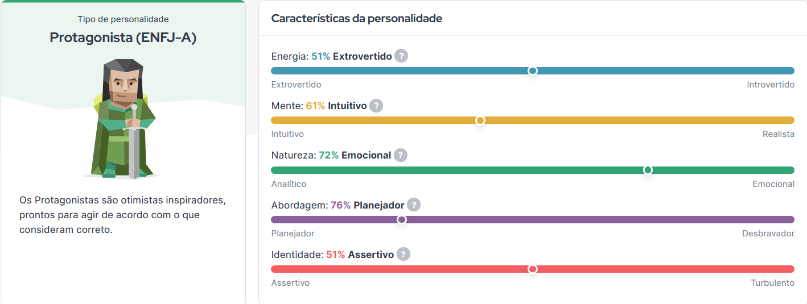

### Hi there, my name is Nilton 👋

👨‍💻💼 I started my journey into the coding world in 2009 at the age of 13, and since then, I've been a technology enthusiast, shaping my path in the programming universe. I love building modern solutions for contemporary problems.

I have solid experience in backend development using .NET Core, SQL Server, and C#, and I master testing techniques, including XUnit, Mocks, and test coverage. On the frontend side, my skills encompass HTML, CSS, JavaScript, TypeScript, Node, and React.

Over the years, I've honed my technical skills, relentlessly striving to deliver quality code. Additionally, I maintain a constant interest in environmental activism, exploring sustainable solutions through coding, permaculture, agroforestry, and bioeconomy. 🌱💻 #CodingForSustainability

I also thoroughly enjoy teamwork, easily integrating into corporate environments, and I never like to stay idle. I am proactive! 🚀

[Personality: ENFJ-A](https://www.16personalities.com/br/resultados/enfj-a/x/pswwtjxe)

