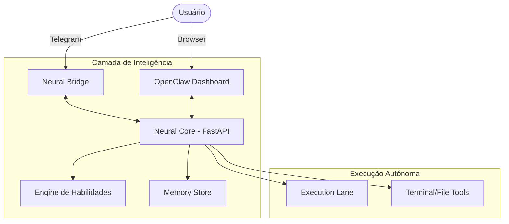

# A Estrutura OpenClaw Pro 🏗️

O Ronaldinho Agent não é monolítico. Ele é uma orquestração de microsserviços e camadas de inteligência que garantem autonomia nível L6.

### O Diagrama de Fluxo

### Componentes Chave

#### 1. Neural Core (Sessão Central)
O cérebro do sistema. Desenvolvido em FastAPI, ele gerencia as requisições, faz a compressão de contexto e decide qual Persona deve entrar em campo.

#### 2. Execution Lanes
Um conceito chave inspirado no OpenClaw. Cada usuário tem uma "Lane" (faixa) de execução. Isso garante que o Ronaldinho não tente editar o mesmo arquivo em duas tarefas diferentes ao mesmo tempo, evitando conflitos de IO.

#### 3. Provedor Agnóstico
O Core não depende de apenas um modelo. Ele utiliza um sistema de **Fallback em Cascata**:
1. Tenta API Principal (ex: Gemini Flash).
2. Se falhar por cota, tenta Fallbacks (OpenAI, Anthropic).
3. Se falhar, ativa o **Ghost Mode** (Navegador).
4. Como última instância, encaminha para a **Antigravity Bridge**.

#### 4. Skills Engine
As habilidades saem de `.agent/skills/`. Cada skill é um módulo Python independente que o agente pode importar e usar para expandir suas capacidades sem precisar reiniciar o sistema.
